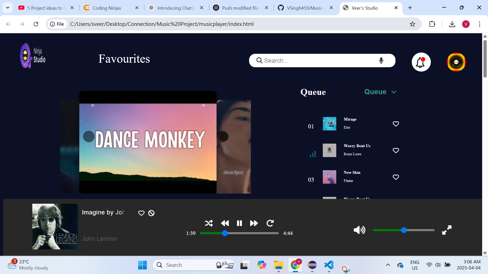

# 🎧 Music Player UI (Frontend Only)

A clean and fully responsive music player interface built using **HTML** and **CSS** only. This project is a design mockup of a music streaming app with all major UI elements — no JavaScript, no backend, just layout and styling.

---

## 🖼️ Preview

👉 [Click here to download the screenshot](Screenshot_1.png)

---

## 🚀 Features

- Album/artwork display
- Favorite and Add-to-Playlist icons
- Now Playing section with player controls
- Queue and recently played tracks
- Artist page with follow button and song list
- Responsive design — looks good on all screen sizes

---

## 🛠️ Built With

- HTML5
- CSS3
- Google Fonts & Icons

---

## 📂 Files Included

- `index.html` – Main music player page
- `index2.html` – Coldplay artist detail page
- `styles.css` – Styling for the main UI
- `h2Style.css` – Styling for the artist page
- `README.md` – You're reading it!

---

## 💡 Notes

This project was created to practice frontend layout and styling. There is **no JavaScript functionality** or actual music playback — it's purely a visual and responsive design.

---

## 🪪 License

MIT License — free to use and modify.
